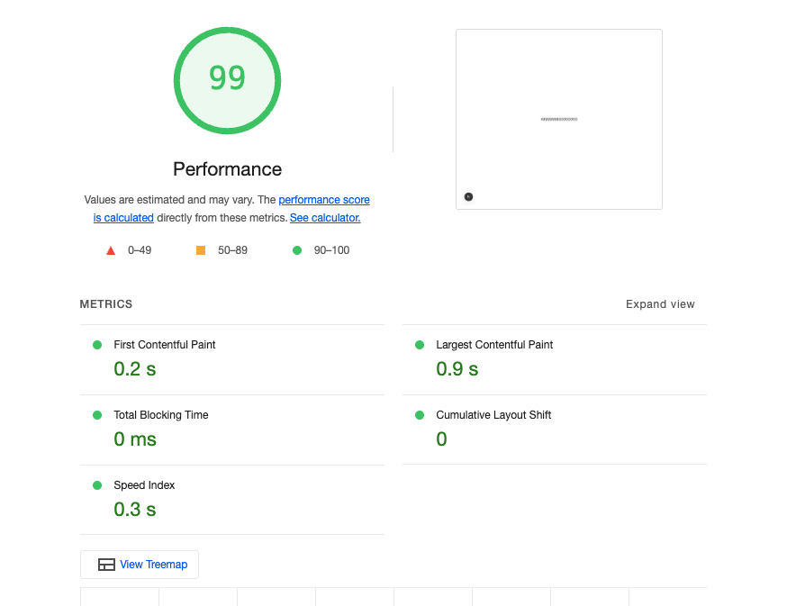

This is a [Next.js](https://nextjs.org) project bootstrapped with [`create-next-app`](https://nextjs.org/docs/app/api-reference/cli/create-next-app).

## Project Metrics
Here's an overview of our application's key metrics:

**Problem:**
The existing `Dashboard` component performed a CPU-intensive calculation (a `for` loop iterating 100 million times) directly within the `useEffect` hook on the main thread. This synchronous operation caused significant main thread blockage, leading to high Total Blocking Time (TBT) and an unresponsive user interface during page load.

**Solution:**
The heavy calculation has been offloaded to a **Web Worker**. This moves the long-running task to a separate background thread, preventing it from blocking the main thread.

**Key Changes:**
* **`src/app/Dashboard.js`**:
    * Initiates a `new Worker` instance for `calculation.worker.js`.
    * Posts a message (`'startCalculation'`) to the worker to begin the computation.
    * Listens for the `onmessage` event from the worker to receive the calculated result.
    * Includes a cleanup function (`worker.terminate()`) in `useEffect` to ensure the worker is properly closed when the component unmounts.
* **`public/calculation.worker.js`**:
    * A new file containing the CPU-intensive `for` loop.
    * Listens for messages from the main thread (specifically `'startCalculation'`).
    * Performs the calculation.
    * Posts the final result back to the main thread.

**Benefits:**
* **Reduced Total Blocking Time (TBT):** The main thread remains free, allowing the UI to stay responsive during the calculation.
* **Improved User Experience (UX):** The dashboard will feel faster and more interactive, as users can scroll, click, and interact with the page while the background computation occurs.
* **Enhanced Performance:** Contributes to better Core Web Vitals scores.